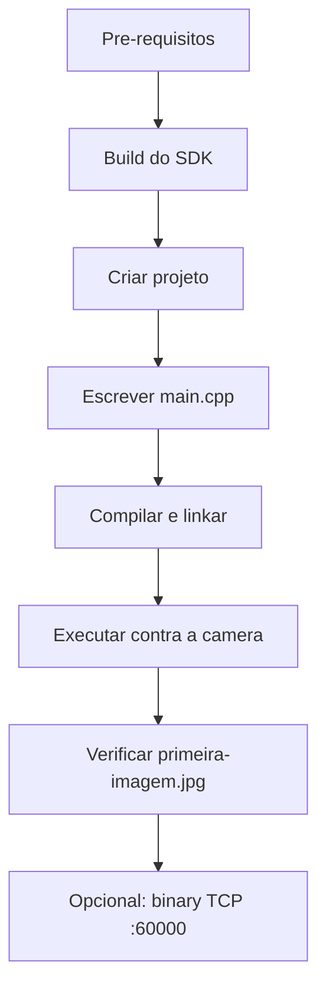

# Primeira imagem com C++

Walkthrough do zero: criar um projeto C++, linkar contra o ITSCAM SDK e salvar a primeira imagem JPEG da câmera em disco. Caminho principal usa o **`ItscamCgiClient`** (HTTP, anônimo por default) e há uma seção opcional no final usando o **`ItscamClient`** (Cougar TCP :60000).



## 1. Pré-requisitos

| Item | Versão mínima | Verificar com |
| ---- | ------------- | ------------- |
| Compilador C++17 | GCC 7+ / Clang 5+ / MinGW-w64 | `g++ --version` |
| GNU make | qualquer | `make --version` |
| Git | qualquer | `git --version` |
| Câmera ITSCAM | ITSCAM450 / ITSCAM600 alcançável na rede | `ping <ip-da-camera>` |

Nada de mbedTLS, cpp-httplib ou nlohmann/json no sistema -- todas as dependências do SDK são vendoradas em [`src/core/3rdparty/`](../../src/core/3rdparty/).

## 2. Obter e buildar o SDK

```bash
git clone https://github.com/pumatronix/itscam-sdk.git
cd itscam-sdk
make lib
```

Depois desse passo você vai ter `libitscam_sdk.so.1.0.0` (e os symlinks `libitscam_sdk.so` / `.so.1`) em `src/core/build/linux/`.

## 3. Criar o projeto

A partir da raiz do checkout do SDK:

```bash
mkdir -p meu-app
cd meu-app
```

Crie um `Makefile` simples:

```make
# meu-app/Makefile
SDK_ROOT := ..
CXXFLAGS := -std=c++17 -O2 -Wall \
            -I$(SDK_ROOT)/src/core \
            -I$(SDK_ROOT)/src/core/3rdparty
LDFLAGS  := -L$(SDK_ROOT)/src/core/build/linux \
            -litscam_sdk -lpthread \
            -Wl,-rpath,'$$ORIGIN:$(SDK_ROOT)/src/core/build/linux'

meu_app: main.cpp
	$(CXX) $(CXXFLAGS) main.cpp -o $@ $(LDFLAGS)

clean:
	rm -f meu_app
.PHONY: clean
```

O `-Wl,-rpath,$ORIGIN` faz o binário encontrar a shared library em runtime sem precisar exportar `LD_LIBRARY_PATH`.

## 4. Escrever o código mínimo

```cpp
// meu-app/main.cpp
#include "itscam_sdk.h"

#include <cstdio>
#include <fstream>
#include <iostream>
#include <string>

int main(int argc, char* argv[]) {
    if (argc < 2) {
        std::fprintf(stderr, "uso: %s <ip-da-camera>\n", argv[0]);
        return 1;
    }
    const std::string host = argv[1];

    itscam::ItscamCgiClient cgi;
    cgi.setBaseUrl(host, 80);
    // Para HTTPS:
    //   cgi.setBaseUrl(host, 443, "https");
    // Para auth opcional (somente se configCgi.blockAPI=true):
    //   cgi.login("admin", "1234");

    auto last = cgi.getLastFrame();
    if (!last) {
        std::fprintf(stderr, "falha em lastframe.cgi: %s\n",
                     last.error().message.c_str());
        return 2;
    }

    const auto& img = last.value();
    std::ofstream out("primeira-imagem.jpg", std::ios::binary);
    out.write(reinterpret_cast<const char*>(img.data.data()),
              static_cast<std::streamsize>(img.data.size()));

    std::cout << "OK: " << img.data.size()
              << " bytes salvos em primeira-imagem.jpg ("
              << img.mimeType << ")\n";
    return 0;
}
```

## 5. Compilar e rodar

```bash
make
./meu_app 192.168.254.254
```

Saída esperada:

```text
OK: 87421 bytes salvos em primeira-imagem.jpg (image/jpeg)
```

Verifique o arquivo:

```bash
file primeira-imagem.jpg
# primeira-imagem.jpg: JPEG image data, JFIF standard 1.01, ...
```

## 6. Troubleshooting

| Sintoma | Causa provável | Solução |
| ------- | -------------- | ------- |
| `error while loading shared libraries: libitscam_sdk.so.1` | rpath não resolvido | Confirme o `-Wl,-rpath,...` no `Makefile`, ou exporte `LD_LIBRARY_PATH=$PWD/../src/core/build/linux`. |
| `Connection refused` / `Timeout` | Porta 80 bloqueada ou IP errado | `curl -v http://<ip>/api/lastframe.cgi -o /dev/null` |
| `HTTP 401` em CGI | A câmera tem `configCgi.blockAPI=true` | Passe `cgi.login("user", "pass")` antes do `getLastFrame()`. |
| `SSL/TLS handshake failed` em HTTPS | CA bundle não configurado | `cgi.setCaCertFile("/etc/ssl/certs/ca-bundle.pem")` ou, só em dev, `cgi.setVerifyServerCertificate(false)`. |

## 7. Opcional: capture via `ItscamClient` (TCP :60000)

O CGI é o caminho mais simples para uma primeira imagem. Se você precisa de **trigger em real time** ou multi-exposure, use o binary client. Ele exige `authenticate()` mesmo que a câmera não tenha CGI auth.

```cpp
#include "itscam_sdk.h"
#include <fstream>
#include <iostream>

int main(int argc, char* argv[]) {
    if (argc < 2) { return 1; }
    itscam::ItscamClient camera;

    if (!camera.connect(argv[1])) {
        std::cerr << "connect falhou\n"; return 2;
    }
    if (!camera.authenticate(argc >= 3 ? argv[2] : "1234")) {
        std::cerr << "authenticate falhou\n"; return 3;
    }

    camera.subscribeCaptures();
    auto result = camera.captureSnapshot();
    if (!result || result.value().empty()) {
        std::cerr << "captureSnapshot falhou\n"; return 4;
    }

    const auto& jpeg = result.value().front().jpeg;
    std::ofstream("primeira-imagem-binary.jpg", std::ios::binary)
        .write(reinterpret_cast<const char*>(jpeg.data()),
               static_cast<std::streamsize>(jpeg.size()));
    std::cout << "OK: " << jpeg.size() << " bytes (binary)\n";
}
```

Detalhe completo (auto-reconnect, exposure groups, eventos de trigger contínuos) em [docs/api/binary-client.md](../api/binary-client.md).

## Próximos passos

- [Guia do wrapper C++](../wrappers/cpp.md) -- padrões idiomáticos.
- [Getting started](../getting-started.md) -- build, exemplos e Docker.
- [Examples completos](../../src/examples/) -- [`itscam_cgi_example.cpp`](../../src/examples/itscam_cgi_example.cpp), [`itscam_sdk_example.cpp`](../../src/examples/itscam_sdk_example.cpp).
- [HTTPS / TLS](../https-tls.md) -- configurar mbedTLS para produção.
