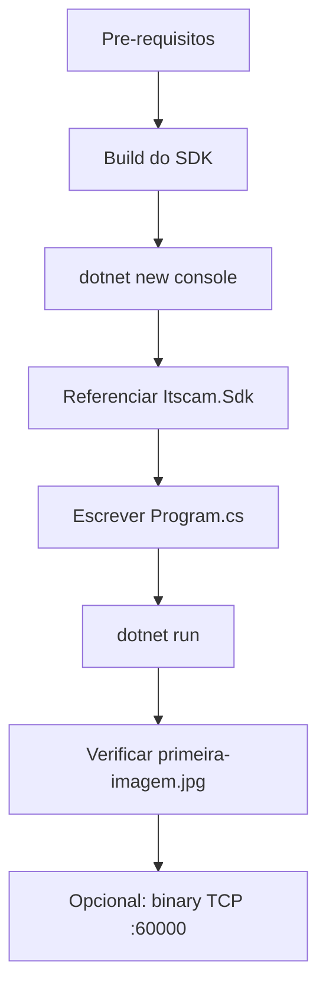

# Primeira imagem com C# / .NET

Walkthrough do zero: criar um projeto .NET console, referenciar o
SDK e salvar a primeira imagem JPEG da câmera em disco. Caminho
principal usa o **`ItscamCgiClient`** (HTTP, anônimo por default) e há
uma seção opcional no final usando o **`ItscamClient`** (Cougar
TCP :60000).



## 1. Pré-requisitos

| Item | Versão mínima | Verificar com |
| ---- | ------------- | ------------- |
| .NET SDK | 6.0+ (ou Framework 4.6.1+) | `dotnet --version` |
| Compilador C++17 | só para `make lib` / `make csharp` | `g++ --version` |
| GNU make | qualquer | `make --version` |
| Git | qualquer | `git --version` |
| Câmera ITSCAM | ITSCAM450 / ITSCAM600 alcançável na rede | `ping <ip-da-camera>` |

## 2. Buildar o SDK e o managed assembly

```bash
git clone https://github.com/pumatronix/itscam-sdk.git
cd itscam-sdk
make lib        # libitscam_sdk.so
make csharp     # Itscam.Sdk.dll (netstandard2.0)
```

Para consumo via NuGet (multi-RID), rode `make csharp-pack`. O
walkthrough abaixo usa o caminho mais simples para desenvolvimento:
**`ProjectReference`** direto ao csproj do SDK.

## 3. Criar o projeto

A partir da raiz do checkout do SDK:

```bash
mkdir -p meu-app && cd meu-app
dotnet new console -n MeuApp -o .
```

## 4. Referenciar o `Itscam.Sdk`

Adicione a referência ao csproj do wrapper:

```bash
dotnet add reference \
    ../src/wrappers/csharp/Itscam.Sdk/Itscam.Sdk.csproj
```

Isso já cuida da cópia do `libitscam_sdk.so` para o output de build
via [`Itscam.Sdk.targets`](../../src/wrappers/csharp/Itscam.Sdk/build/Itscam.Sdk.targets)
quando o native binary está em
`src/core/build/<rid>/`.

> Consumindo via NuGet em vez de `ProjectReference`?
>
> ```bash
> make csharp-pack
> dotnet add package Pumatronix.Itscam.Sdk \
>     --source ../src/wrappers/csharp/nupkg
> ```

## 5. Escrever o código mínimo

Substitua `MeuApp/Program.cs` por:

```csharp
// MeuApp/Program.cs
using System;
using System.IO;
using System.Threading.Tasks;

using Pumatronix.Itscam;

class Program
{
    static async Task<int> Main(string[] args)
    {
        if (args.Length < 1)
        {
            Console.Error.WriteLine("uso: dotnet run -- <ip-da-camera>");
            return 1;
        }
        string host = args[0];

        using var cgi = new ItscamCgiClient();
        cgi.SetBaseUrl(host, 80);
        // Para HTTPS:
        //   cgi.SetBaseUrl(host, 443, "https");
        // Para auth opcional (somente se configCgi.blockAPI=true):
        //   await cgi.LoginAsync("admin", "1234");

        var frame = await cgi.GetLastFrameAsync();
        File.WriteAllBytes("primeira-imagem.jpg", frame.Data);

        Console.WriteLine(
            $"OK: {frame.Data.Length} bytes salvos em " +
            $"primeira-imagem.jpg ({frame.MimeType})");
        return 0;
    }
}
```

## 6. Executar

```bash
dotnet run -- 192.168.254.254
```

Saída esperada:

```text
OK: 87421 bytes salvos em primeira-imagem.jpg (image/jpeg)
```

Verifique o arquivo:

```bash
file primeira-imagem.jpg
# primeira-imagem.jpg: JPEG image data, JFIF standard 1.01, ...
```

## 7. Troubleshooting

| Sintoma | Causa provável | Solução |
| ------- | -------------- | ------- |
| `DllNotFoundException: itscam_sdk` | Native binary não foi copiado para `bin/Debug/.../` | Confirme `make lib` no SDK; o `Itscam.Sdk.targets` espera `src/core/build/linux/`. |
| `ItscamConnectionException` | IP errado ou porta 80 bloqueada | `curl -v http://<ip>/api/lastframe.cgi -o /dev/null` |
| `ItscamAuthException` em CGI | A câmera tem `configCgi.blockAPI=true` | Chame `await cgi.LoginAsync("user", "pass")` antes do `GetLastFrameAsync()`. |
| `ItscamException: SSL` em HTTPS | CA bundle não configurado | `cgi.SetCaCertFile("/etc/ssl/certs/ca-bundle.pem")` ou, só em dev, `cgi.SetVerifyServerCertificate(false)`. |

## 8. Opcional: capture via `ItscamClient` (TCP :60000)

O CGI é o caminho mais simples. Se você precisa de **trigger em real
time** ou multi-exposure, use o binary client (porta 60000):

```csharp
// Program.cs (variante binary)
using Pumatronix.Itscam;

string host = args[0];
string password = args.Length > 1 ? args[1] : "1234";

using var camera = new ItscamClient();
await camera.ConnectAsync(host);
await camera.AuthenticateAsync(password);
await camera.SubscribeCapturesAsync();

var results = await camera.CaptureSnapshotAsync();
if (results == null || results.Count == 0)
{
    Console.Error.WriteLine("nenhum frame retornado");
    return 2;
}

File.WriteAllBytes("primeira-imagem-binary.jpg", results[0].Jpeg);
Console.WriteLine($"OK: {results[0].Jpeg.Length} bytes (binary)");
```

Detalhe completo (auto-reconnect, exposure groups, eventos de trigger
contínuos via `TriggerImage` event) em
[docs/api/binary-client.md](../api/binary-client.md) e no example
[`CaptureExample/Program.cs`](../../src/wrappers/csharp/examples/CaptureExample/Program.cs).

## Próximos passos

- [Guia do wrapper C#](../wrappers/csharp.md) -- API completa.
- [Examples C#](../../src/wrappers/csharp/examples/) -- `CaptureExample`,
  `MjpegGrabberExample`, `SoftwareTriggerSnapshotExample`.
- [HTTPS / TLS](../https-tls.md) -- configurar mbedTLS para produção.
- [Codegen REST](../codegen.md) -- regenerar `RestTypes.g.cs` para um
  firmware específico.
